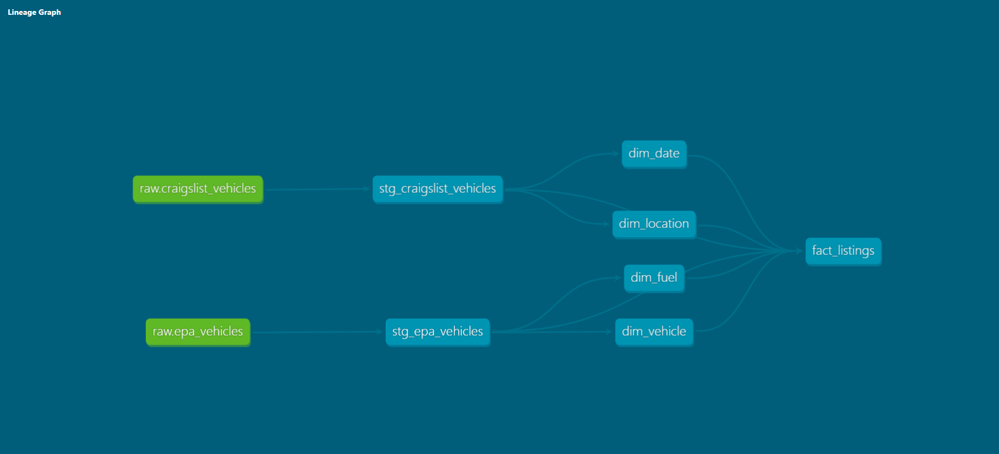
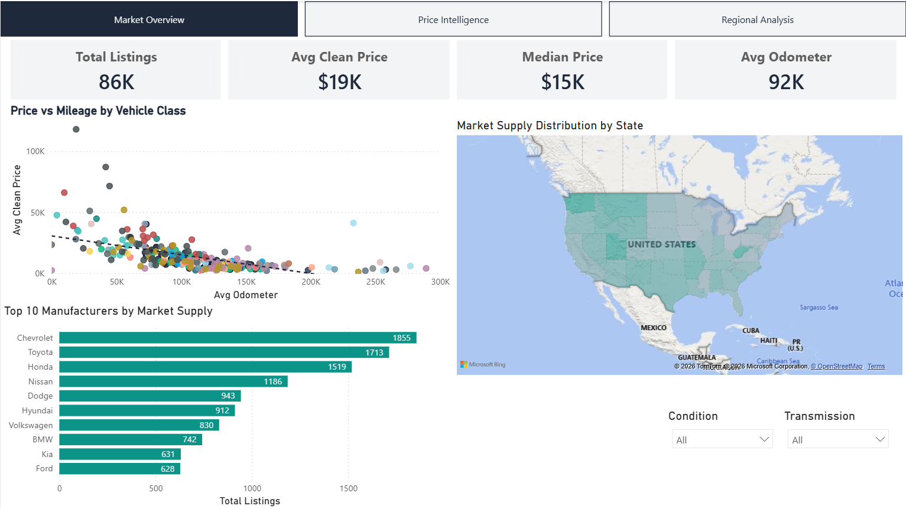
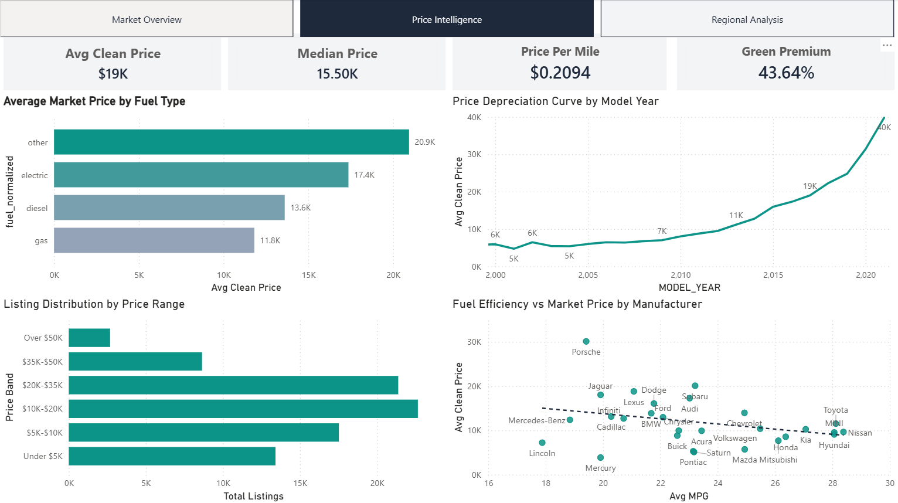
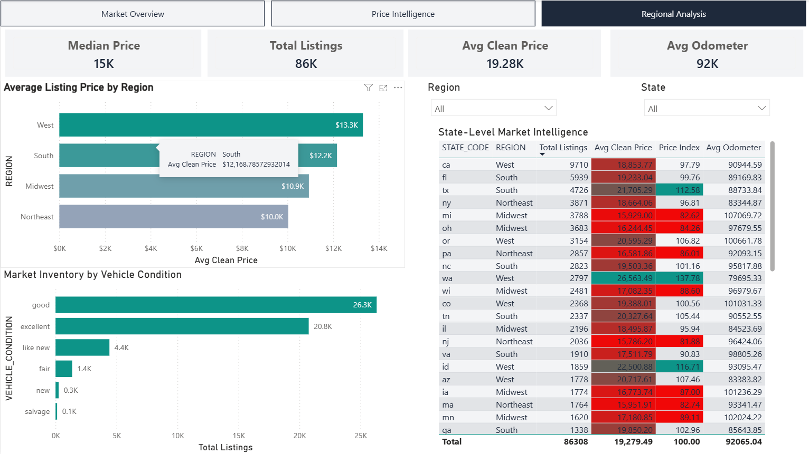
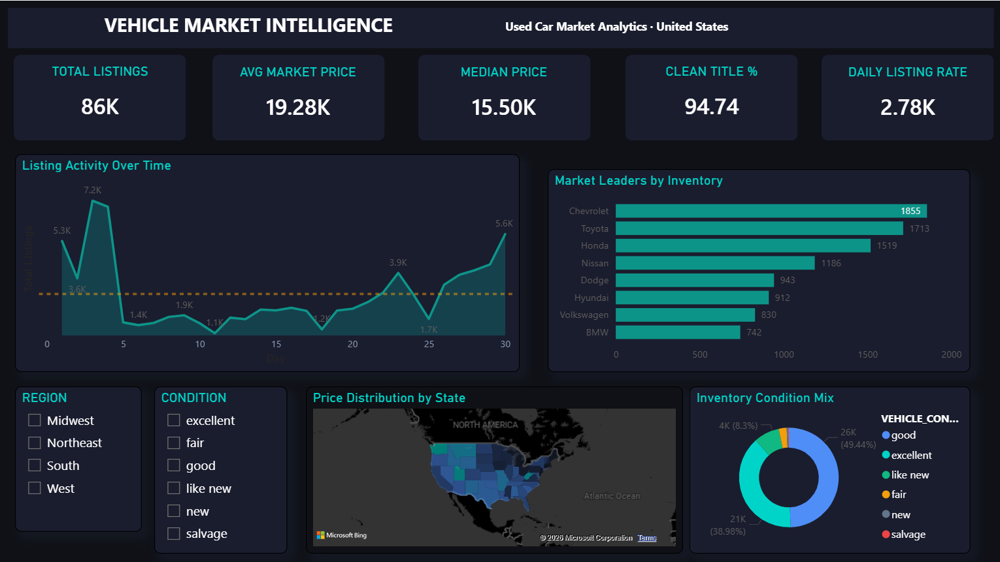

# Vehicle Market Analytics Pipeline

An end-to-end data pipeline combining EPA fuel economy data with Craigslist used car listings to analyze vehicle market pricing against fuel efficiency.

## Architecture

**Tools & Technologies**
- Snowflake (cloud data warehouse)
- dbt (data transformation and modeling)
- Power BI (dashboard and visualization)
- Python (data preparation and cleaning)
- AWS S3 (raw file storage)
- Git / GitHub (version control)

## Data Sources

| Source                | Description                                                           | Rows |
|-----------------------|-----------------------------------------------------------------------|------|
| EPA Fuel Economy      | Official vehicle fuel economy and emissions data (fueleconomy.gov)    | ~50K |
| Craigslist Used Cars  | Used car market listings across US states                             | ~95K |

## Pipeline Architecture
Raw Layer (Snowflake)
├── raw.epa_vehicles
└── raw.craigslist_vehicles
↓
Staging Layer (dbt views)
├── stg_epa_vehicles       (cleaned, renamed, normalized)
└── stg_craigslist_vehicles (cleaned, renamed, normalized)
↓
Analytics Layer (dbt tables)
├── dim_vehicle
├── dim_fuel
├── dim_location
├── dim_date
└── fact_listings
↓
Power BI Dashboard

## Star Schema

- **fact_listings** — one row per used car listing with EPA specs joined
- **dim_vehicle** — vehicle make, model, year, engine specs
- **dim_fuel** — fuel type, EPA scores, emissions, annual cost
- **dim_location** — US state with region grouping
- **dim_date** — date attributes derived from listing dates

## Key Engineering Decisions

- Normalized transmission and fuel type across both sources to enable accurate EPA to Craigslist joins
- Deduplicated EPA records using row_number() before joining to prevent fanout
- Three layer dbt architecture: raw, staging, analytics
- Surrogate keys generated via dbt_utils.generate_surrogate_key()
- dbt tests applied to all dimension tables for data quality validation

## Dashboard Screenshots

## Pipeline Lineage

### Page 1: Market Overview

### Page 2: Price Intelligence

### Page 3: Regional Analysis

### Page 4: Market Command Center (v2 - Dark Theme)

## How to Run

1. Clone this repo
2. Install dependencies: `dbt deps`
3. Configure your Snowflake profile in `~/.dbt/profiles.yml`
4. Run models: `dbt run`
5. Run tests: `dbt test`
6. Generate docs: `dbt docs generate && dbt docs serve`

## Dashboard Insights

- Average listing price by vehicle make and region
- Fuel efficiency vs market price correlation
- Listing volume by state
- Price trends by vehicle condition and odometer range
